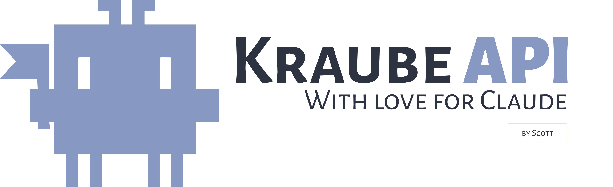

<div align="center">



**Lightweight Go gateway for Anthropic Messages API via OAuth subscription**

Access Claude (Opus, Sonnet, Haiku) through your Pro/Max/Team subscription. No API key needed.

[](https://github.com/scott-walker/kraube-api/actions/workflows/ci.yml)
[](https://github.com/scott-walker/kraube-api/releases/latest)
[](https://goreportcard.com/report/github.com/scott-walker/kraube-api)
[](LICENSE)

[Quick Start](#quick-start) · [TokenProvider](#tokenprovider) · [Usage Guide](#usage-guide) · [Releases](https://github.com/scott-walker/kraube-api/releases)

</div>

---

## What it does

- **OAuth gateway** to Anthropic Messages API through claude.ai subscription (Pro/Max/Team)
- **Stateless** — token comes from any source via `TokenProvider` interface
- **Replicates** Claude Code CLI protocol: billing header, metadata, beta headers, Chrome TLS
- **Streaming** and non-streaming requests, tool use, extended thinking, vision, documents
- **Lightweight** — minimal wrapper over HTTP, not a framework

## Quick Start

### Install

```bash
go get github.com/scott-walker/kraube-api
```

### Authenticate

```bash
go build -o kraube ./cmd/kraube/
kraube login
```

Opens browser for OAuth, saves credentials to `~/.config/kraube/credentials.json`.

### Use

```go
ctx := context.Background()

client, err := kraube.NewClient(ctx, kraube.WithCredentialsFile(""))
if err != nil {
    log.Fatal(err)
}

resp, err := client.Messages.Create(ctx, &kraube.MessageRequest{
    Model:     kraube.ModelSonnet4_6,
    MaxTokens: 1024,
    Messages:  []kraube.Message{kraube.UserMessage("Hello!")},
})
fmt.Println(resp.Text())
```

## TokenProvider

Single interface for authentication. Token can come from anywhere:

```go
type TokenProvider interface {
    Token(ctx context.Context) (*Credentials, error)
}
```

Built-in providers:

| Option | Description | Auto-refresh |
|--------|-------------|:---:|
| `WithCredentialsFile(path)` | JSON file, refreshes back to disk | Yes |
| `WithAccessToken(token)` | Static token, no refresh | No |
| `WithCredentials(creds)` | Credentials struct with refresh_token | Yes |
| `WithEnvToken(envVar)` | Environment variable | No |
| `WithTokenProvider(p)` | Any custom implementation | Up to you |

```go
// From file (after kraube login)
client, _ := kraube.NewClient(ctx, kraube.WithCredentialsFile(""))

// Static token
client, _ := kraube.NewClient(ctx, kraube.WithAccessToken(os.Getenv("MY_TOKEN")))

// Custom provider (Vault, Redis, DB...)
client, _ := kraube.NewClient(ctx, kraube.WithTokenProvider(myVaultProvider))
```

## Usage Guide

### Streaming

```go
stream, err := client.Messages.Stream(ctx, &kraube.MessageRequest{
    Model:     kraube.ModelSonnet4_6,
    MaxTokens: 1024,
    Messages:  []kraube.Message{kraube.UserMessage("Tell me a story")},
})
defer stream.Close()

for stream.Next() {}
fmt.Println(stream.Message().Text())
```

### System Prompt

```go
resp, _ := client.Messages.Create(ctx, &kraube.MessageRequest{
    Model:    kraube.ModelSonnet4_6,
    MaxTokens: 1024,
    System:   kraube.SystemText("You are a helpful assistant."),
    Messages: []kraube.Message{kraube.UserMessage("Hi")},
})
```

### Tool Use

```go
tool := kraube.Tool{
    Name:        "get_weather",
    Description: "Get weather for a city",
    InputSchema: &kraube.Schema{
        Type: "object",
        Properties: map[string]*kraube.Schema{
            "city": {Type: "string", Desc: "City name"},
        },
        Required: []string{"city"},
    },
}

resp, _ := client.Messages.Create(ctx, &kraube.MessageRequest{
    Model:     kraube.ModelSonnet4_6,
    MaxTokens: 1024,
    Tools:     []kraube.Tool{tool},
    Messages:  []kraube.Message{kraube.UserMessage("Weather in Tokyo?")},
})

if resp.HasToolUse() {
    for _, tu := range resp.ToolUses() {
        fmt.Printf("Tool: %s, Input: %s\n", tu.Name, string(tu.Input))
    }
}
```

Built-in tools:

```go
kraube.WebSearchTool()      // web search
kraube.CodeExecutionTool()  // code execution
kraube.TextEditorTool()     // text editor (Claude Code style)
kraube.BashTool()           // bash execution
```

### Extended Thinking

```go
resp, _ := client.Messages.Create(ctx, &kraube.MessageRequest{
    Model:     kraube.ModelOpus4_6,
    MaxTokens: 8192,
    Thinking:  kraube.ThinkingEnabled(4096),
    Messages:  []kraube.Message{kraube.UserMessage("Solve this...")},
})

for _, b := range resp.ThinkingBlocks() {
    fmt.Println("Thinking:", b.Thinking)
}
fmt.Println("Answer:", resp.Text())
```

### Vision

```go
resp, _ := client.Messages.Create(ctx, &kraube.MessageRequest{
    Model:     kraube.ModelSonnet4_6,
    MaxTokens: 1024,
    Messages: []kraube.Message{
        kraube.UserBlocks(
            kraube.TextBlock("What's in this image?"),
            kraube.ImageURLBlock("https://example.com/photo.jpg"),
        ),
    },
})
```

### Error Handling

```go
resp, err := client.Messages.Create(ctx, req)
if err != nil {
    var apiErr *kraube.APIError
    if errors.As(err, &apiErr) {
        switch {
        case apiErr.IsRateLimit():
            // wait and retry
        case apiErr.IsOverloaded():
            // server overloaded
        case apiErr.IsAuthentication():
            // invalid token
        }
    }
}
```

## Architecture

```
Your code ──▶ kraube.Client
                  │
          ┌───────┴───────┐
          ▼               ▼
    TokenProvider     HTTP Transport
    (any source)      (Chrome TLS)
          │               │
          ▼               ▼
    OAuth Token    api.anthropic.com
                   + billing header
                   + metadata.user_id
                   + beta headers
```

## CLI

```bash
go build -o kraube ./cmd/kraube/

kraube login                  # OAuth via browser
kraube "What is Go?"          # send a message
kraube stream "Tell me..."    # stream response
kraube usage                  # subscription limits
kraube --debug "prompt"       # debug logging
```

## Documentation

- [Usage Examples](docs/usage.md) — full code examples
- [Architecture](docs/architecture.md) — project structure
- [Principles](docs/principles.md) — design decisions
- [Protocol](docs/protocol.md) — Claude Code CLI HTTP protocol
- [API Coverage](docs/api-coverage.md) — what's implemented
- [Changelog](CHANGELOG.md) — version history

## License

MIT
